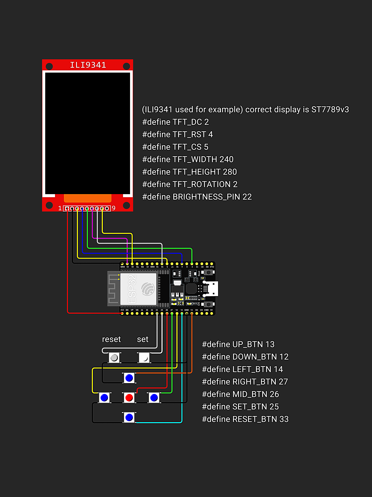

Projeto com finalidade de estudo.

##### O projeto abrange o uso e implementação de módulos para utilizar as seguintes tecnologias no chip esp-wroom-32:
- MQTT
- WIFI
- Display TFT
- QR Code
- EspIdf
  
Comportamento do projeto:

O projeto nescessitou de modificações nas bibliotecas de criação de QR Code, para possibilitar a manipulação da posição na tela, orientação, cor e tamanho.

[PCB design]("./PCB/README.md")

https://github.com/user-attachments/assets/a6a9281f-d669-4173-a714-b087a6bd3946

https://github.com/user-attachments/assets/3ddc213c-13c7-4853-abfa-3d07ee0f7417

https://github.com/user-attachments/assets/8f52a135-1712-491a-afcf-a7a2c877dedc

https://github.com/user-attachments/assets/dddc63e7-bb89-4d46-a7b6-cc8748e9e5a6

